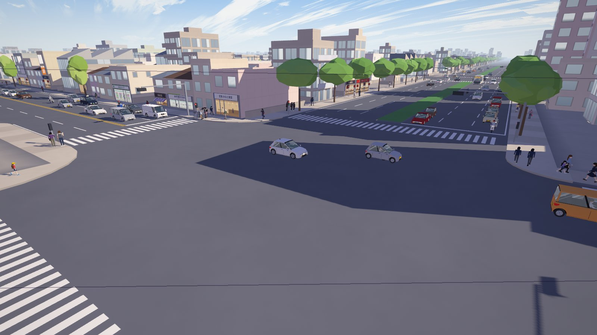
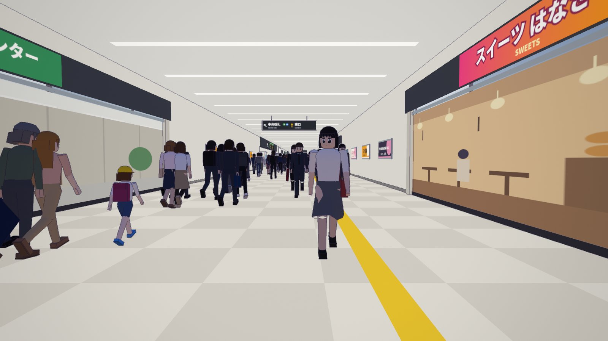
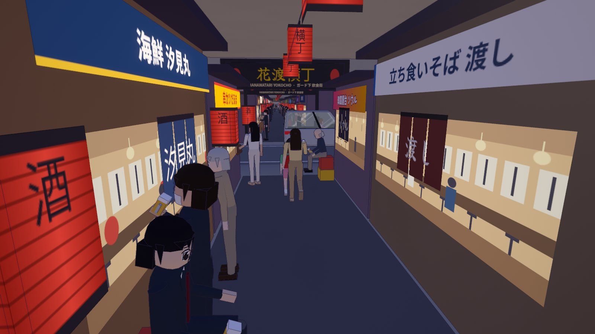
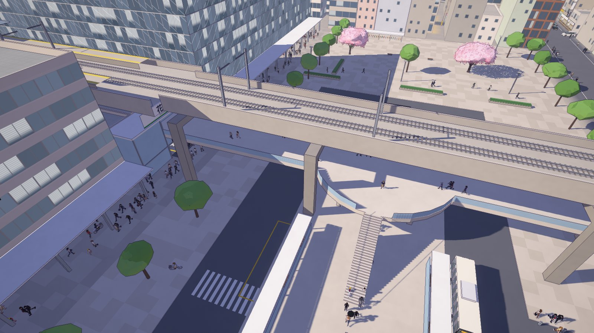
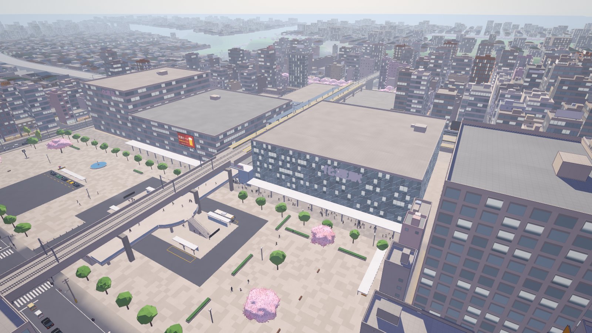
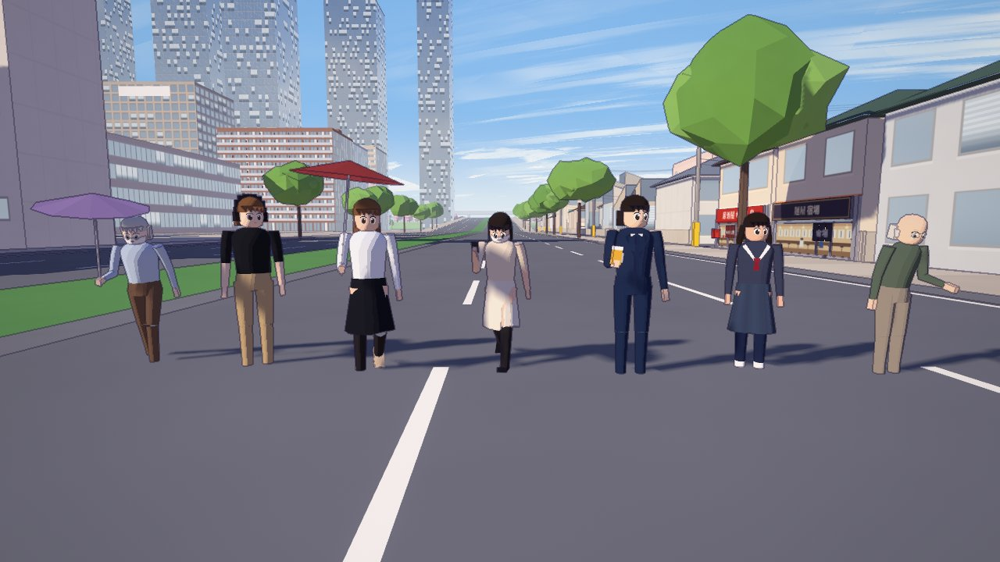
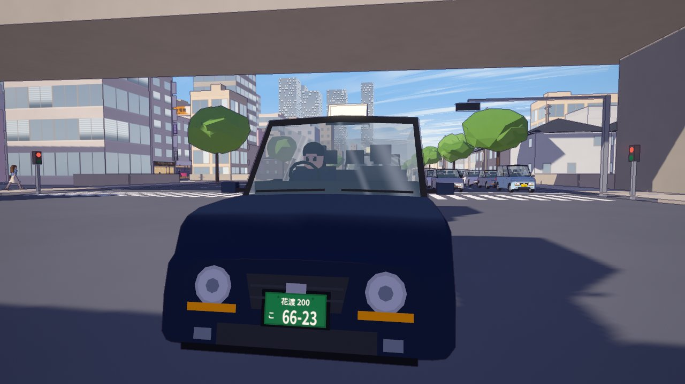

# 花渡市 · Hanawatari

歩いて回れる、アニメ調（セル画風）の日本の街です。three.js だけで作っていて、ビルドは不要です。3D モデルなどの外部素材も使っていません。
地形、線路、道路、建物、駅、電車、車、人、看板、ナンバープレート、音まで、すべてコードで生成しています。
季節は春、時刻は夕方4時ごろです。

A walkable, first-person **anime cel-shaded Japanese city** in plain [three.js](https://threejs.org/) — no build step, no external 3D assets. Terrain, railways, roads, buildings, the station, trains, cars, people, signs, number plates and sound are all generated in code. A spring afternoon, around four o'clock.



| | |
|---|---|
|  |  |
|  |  |
|  |  |

## 特徴 · Features

- **3 km 四方の街**：花渡駅を中心に、駅前、商店街、下町、川と運河、高台の公園、寺町、丘の住宅地があります。周りの街並みは歩くにつれて生成されます。
- **駅**：次の場所を作っています。
  - 自由通路と改札
  - 東口の駅前広場：バスターミナル、タクシー乗り場、ペデストリアンデッキ
  - 西口の広場
  - 高架下の飲み屋横丁
  - アーケード商店街
- **鉄道**：高架と地上の路線、路面電車、踏切（遮断機と警報音付き）があります。
- **交通**：車線網の上を追従モデル（IDM）で走ります。
  - 信号、右折待ち、一時停止、合流、踏切、車線変更、ウインカーとブレーキランプ
  - 車13種と二輪4種。原付は時速30 kmを守り、大きな信号交差点では右折しません（二段階右折の代わり）
- **車体**：曲面の車体と切り欠いたホイールアーチです。ガラス越しに車内（シート、右ハンドル）と運転手が見え、ナンバーには文字が入っています。
- **人**：数百人の歩行者を GPU 上でポーズ付けしています。
  - 役柄ごとの服装：会社員、学生、子ども、高齢者など
  - 手に持つ物：日傘、スマホ、ジョッキなど
  - 歩き方：歩道を左側通行し、青信号で横断歩道を渡り、信号のない道は車が途切れてから渡る
  - 車は横断中の人に譲ります
  - ママチャリも走り、友達同士は並んで歩き、横丁では立ち飲みの客が店先にいます
- **見た目**：トゥーン陰影、色になじむ輪郭線、ブルーム、夕方の光と空です。

- **A 3 km city** round 花渡 station: the station front, a shopping arcade, old town, rivers and canals, a hill park, a temple quarter, hillside houses. The surroundings are built as you walk.
- **The station**: a free passage with ticket gates, the east square (bus terminal, taxi rank, pedestrian deck), the west square, a drinking alley under the viaduct.
- **Railways**: elevated and surface lines, a tram, level crossings with barriers and bells.
- **Traffic** on a lane graph with the Intelligent Driver Model: signals, right turns waiting for a gap, stop signs, merging, level crossings, lane changes, indicators and brake lamps. 13 car models and 4 two-wheelers; 50 cc scooters keep to 30 km/h and don't turn right at big junctions.
- **Vehicles**: smooth bodies with real wheel arches, see-through glass with the interior (right-hand drive) and a driver, number plates with text.
- **People**: hundreds of pedestrians posed on the GPU. They dress by role and carry parasols, phones and mugs. They keep left on the sidewalk, cross on the walk light and cross streets when no car comes. Cars give way to them. There are mamachari bicycles, friends walking together, and regulars at the bar counters.
- **Look**: toon shading, colour-aware outlines, bloom, a late-afternoon sky.

## 動かし方 · Run

```bash
node tools/serve.mjs
```

<http://localhost:5173> を開いてください。three.js（jsDelivr）とフォント（Google Fonts）を読み込むので、インターネット接続が必要です。静的ファイルを配信できるサーバーなら何でも動きます（`file://` では動きません）。

Open <http://localhost:5173>. three.js and the fonts load from jsDelivr and Google Fonts, so you need a connection. Any static file server works; ES modules need HTTP, not `file://`.

| キー · Key | 操作 · Action |
|---|---|
| マウス · Mouse | 視点（クリックでポインタをロック）· look (click to lock the pointer) |
| W A S D / 矢印 · arrows | 歩く · walk |
| Shift | 走る · run |
| Space | ジャンプ · jump |
| F | 飛行モード（E / Q で上下）· fly (E / Q up and down) |
| 1 – 9 | 名所へ移動 · go to a place |
| Tab | 地図 · map |
| R | スタート地点へ · back to the start |
| H / M | UI を隠す / 消音 · hide the UI / mute |

## 開発 · Development

`npm install` を実行すると、ヘッドレス用ツールが使えるようになります（puppeteer-core と three）。GPU の使える Chrome か Edge が必要です。見つからないときは `CHROME_PATH` でパスを指定してください。

`npm install` sets up the headless tools (puppeteer-core, three). They need Chrome or Edge with a GPU; set `CHROME_PATH` if yours isn't found.

| ツール · Tool | 内容 · What it does |
|---|---|
| `tools/shot.mjs` | 本物のレンダラーでスクリーンショットを撮る · screenshots with the real renderer (`--cams "x,y,z,yaw,pitch;…" --t 30 --eval "…"`) |
| `tools/sim-test.mjs` | 交通と歩行者を一定時間回して集計する · runs the traffic and the people for a while and reports (stuck vehicles, red runs, cars over people, waits, ms per step) |
| `tools/plan-check.mjs` | 街の計画の整合性チェック · checks the city plan (bridges, tunnels, level crossings) |
| `tools/plan-map.mjs` | 計画図を SVG / PNG にする · draws the plan as a map |
| `tools/capture.mjs` | 動画用のフレームを撮る · frames for a video (then ffmpeg) |
| `tools/vehicle-studio.mjs` | 車種ごとの近景 · close-ups of the vehicle models |
| `tools/sheet.mjs` | 比較用の一覧画像 · contact sheets |

コードの構成は [docs/ARCHITECTURE.md](docs/ARCHITECTURE.md) にまとめています。 · How the code fits together: [docs/ARCHITECTURE.md](docs/ARCHITECTURE.md).

## クレジット · Credits

描画の基盤（レンダラー、マテリアル、空、プレイヤー、物理、音）は、MIT ライセンスの [桜ヶ丘駅 · Sakuragaoka Station](https://github.com/Kenton-GMI/sakuragaoka-station) のものです。three.js も MIT ライセンスです。
地名、店名、会社名はすべて架空です。

The rendering platform (renderer, materials, sky, player, physics, audio) comes from [Sakuragaoka Station](https://github.com/Kenton-GMI/sakuragaoka-station) (MIT). three.js is MIT. Every place, shop and company name is fictional.

## ライセンス · License

MIT
